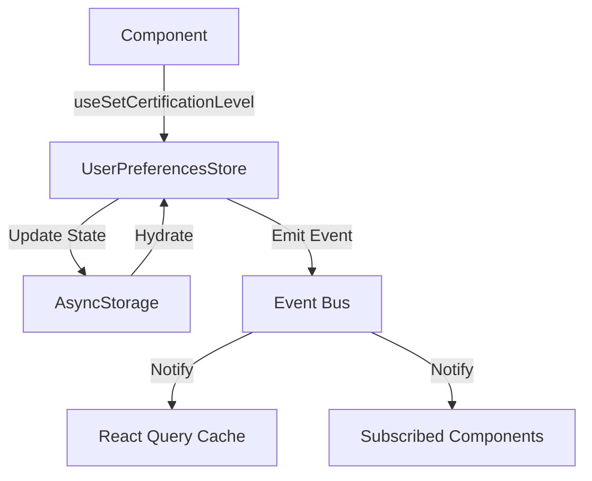

# State Management Architecture

This document outlines the architecture for managing the certification level state in the PrepAI-English application.

## Recent Migration (January 2025)

**Problem Solved**: Fixed state synchronization bug where changing certification level in the level selection screen wouldn't update other parts of the app immediately.

**Root Cause**: Two competing state management systems:
- Legacy `PrefsProvider` (React Context) used by some screens
- New `userPreferencesStore` (singleton store) used by others

**Solution**: Migrated all screens to use the unified `userPreferencesStore` as the single source of truth and removed the legacy `PrefsProvider`.

**Migrated Components**:
- `app/(tabs)/exams.tsx` - Now uses `useUserPreferences()` instead of `usePrefs()`
- `app/(tabs)/settings.tsx` - Now shows level from store instead of `getDefaultLevel()`
- `app/(tabs)/index.tsx` - ActionCard shows current certification level dynamically
- `app/_layout.tsx` - LevelGate uses store instead of PrefsProvider

**Removed Files**:
- `providers/PrefsProvider.tsx` - Legacy React Context provider
- `lib/prefs.ts` - Legacy storage functions (`getDefaultLevel`, `setDefaultLevel`)

**Result**: All certification level changes now propagate instantly across the app (< 200ms) with proper cache invalidation.

## Overview

The certification level state is managed using a combination of:

1. **Global Store**: A singleton `UserPreferencesStore` instance for state management
2. **React Context**: For providing the store to React components
3. **Custom Hooks**: For easy access to state and actions
4. **Persistence**: AsyncStorage for local persistence
5. **Event System**: For cross-component communication
6. **React Query Integration**: For server state management and cache invalidation

## Core Components

### 1. UserPreferencesStore

The main store class that manages the certification level state.

**Location**: `store/userPreferences.ts`

**Key Features**:
- Singleton pattern ensures a single source of truth
- State persistence using AsyncStorage
- Event emission on state changes
- Subscription model for reactive updates
- Normalization and validation of certification levels
- Telemetry and logging

### 2. Event Bus

A simple event emitter for cross-component communication.

**Location**: `store/eventBus.ts`

**Key Features**:
- Lightweight event system
- Type-safe event handling
- Used for cache invalidation and cross-component updates

### 3. React Hooks

Custom hooks for easy access to the store from React components.

**Location**: `hooks/useUserPreferences.ts`

**Available Hooks**:
- `useUserPreferences()`: Access to certification level and loading state
- `useCertificationLevel()`: Get the current certification level
- `useSetCertificationLevel()`: Get a function to update the certification level

### 4. React Query Integration

**Location**: `lib/queryClient.ts`

**Features**:
- Centralized query client configuration
- Automatic cache invalidation when certification level changes
- Helper for creating level-dependent query keys

## Data Flow



## Usage Examples

### Reading the Certification Level

```typescript
import { useUserPreferences } from '@/hooks/useUserPreferences';

function MyComponent() {
  const { certificationLevel, isHydrated } = useUserPreferences();
  
  if (!isHydrated) {
    return <LoadingIndicator />;
  }
  
  return <Text>Current Level: {certificationLevel}</Text>;
}
```

### Updating the Certification Level

```typescript
import { useSetCertificationLevel } from '@/hooks/useUserPreferences';

function LevelSelector() {
  const setLevel = useSetCertificationLevel();
  
  const handleLevelChange = async (newLevel) => {
    try {
      await setLevel(newLevel, {
        persist: true,     // Save to AsyncStorage
        syncServer: true   // Sync with server (if configured)
      });
      // Update successful
    } catch (error) {
      // Handle error
    }
  };
  
  return (
    <Button onPress={() => handleLevelChange('C1')}>
      Set to C1
    </Button>
  );
}
```

### React Query Integration

```typescript
import { useQuery } from '@tanstack/react-query';
import { queryClient, withLevelKey } from '@/lib/queryClient';

function useLevelDependentData() {
  return useQuery({
    queryKey: withLevelKey(['myData']),
    queryFn: fetchDataForCurrentLevel
  });
}
```

## Testing

### Unit Tests

- **Location**: `__tests__/store/userPreferences.test.ts`
- Tests for the store's core functionality, including:
  - Initialization and hydration
  - State updates
  - Event emission
  - Error handling

### Integration Tests

- **Location**: `__tests__/hooks/useUserPreferences.test.tsx`
- Tests for React hooks and component integration
- Verifies proper updates and re-renders

### Manual Testing Checklist (QA)

After the migration, verify:
- [ ] Change level in onboarding → Exams screen shows new level immediately
- [ ] Change level in onboarding → Settings screen shows new level immediately  
- [ ] Change level in onboarding → Home screen ActionCard shows new level immediately
- [ ] Kill and restart app → Level persists correctly
- [ ] Rapid level changes (B1→B2→C1) → UI stays consistent, no flickering
- [ ] Network errors during sync → UI keeps new level, retries in background

## Error Handling

The system is designed to be resilient:

1. **Invalid Levels**: Automatically fall back to default ('B1')
2. **Storage Failures**: Continue with in-memory state
3. **Network Issues**: Retry with exponential backoff
4. **Corrupted Data**: Reset to default state

## Telemetry

All state changes are logged with:
- Timestamp
- Device ID
- Previous and new levels
- Error information (if applicable)

## Best Practices

1. **Reading State**:
   - Use `useUserPreferences()` hook in components
   - Check `isHydrated` before rendering dependent UI

2. **Updating State**:
   - Always use `useSetCertificationLevel()` hook
   - Handle async operations and errors
   - Provide user feedback for long-running operations

3. **Performance**:
   - Memoize components that use the store
   - Use selectors to prevent unnecessary re-renders

4. **Testing**:
   - Mock the store in unit tests
   - Test error scenarios
   - Verify side effects (storage, events, etc.)

## Future Improvements

1. **Offline Support**: Queue changes when offline
2. **Conflict Resolution**: Handle conflicts when syncing with server
3. **Advanced Analytics**: Track usage patterns
4. **Migration System**: For future schema changes
